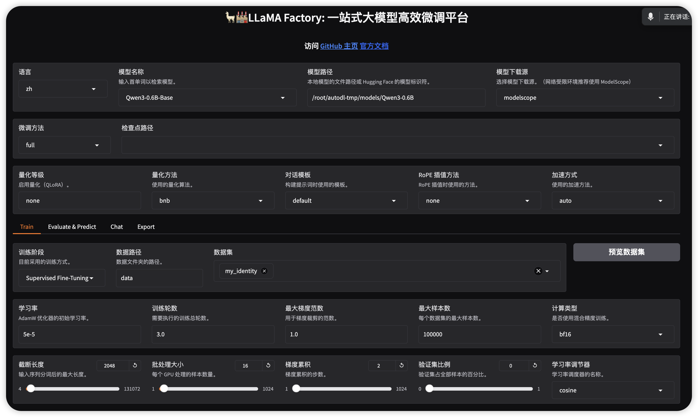

## Step by Step


### 1 登录服务器
#### 1.1 VSCode 安装插件


#### 1.2 配置 SSH 服务

```sh
Host AutoDL-5090-Traning    # 自命名
    HostName connect.westd.seetacloud.com   # IP 地址
    Port 41664  # 端口号
    User root   # 用户名
```

#### 1.3 设置免密登录


### 2 搭建 Llama-Factory 环境
- 官网: https://github.com/hiyouga/LLaMA-Factory

#### 2.1 创建独立的 Conda 环境

```sh
conda create -n llama-factory python=3.10

git clone --depth 1 https://github.com/hiyouga/LLaMA-Factory.git
cd LLaMA-Factory

conda activate llama-factory
pip install -e ".[torch,metrics]" --no-build-isolation

pip install deepspeed
```

### 3 下载模型

- Qwen3-0.6B: https://modelscope.cn/models/Qwen/Qwen3-0.6B

- 手动下载模型权重：
```
wget https://modelscope.cn/models/Qwen/Qwen3-0.6B/resolve/master/model.safetensors
```

### 4 准备数据集

复制下面数据集为 xxx_identity：
```
LLaMA-Factory/data/identity.json
```

注册 `dataset_info.json`

```json
"xxx_identity": {
    "file_name": "xxx_identity.json"
  },
```

### 5 启动 web ui 训练方式

```
llamafactory-cli webui
```

